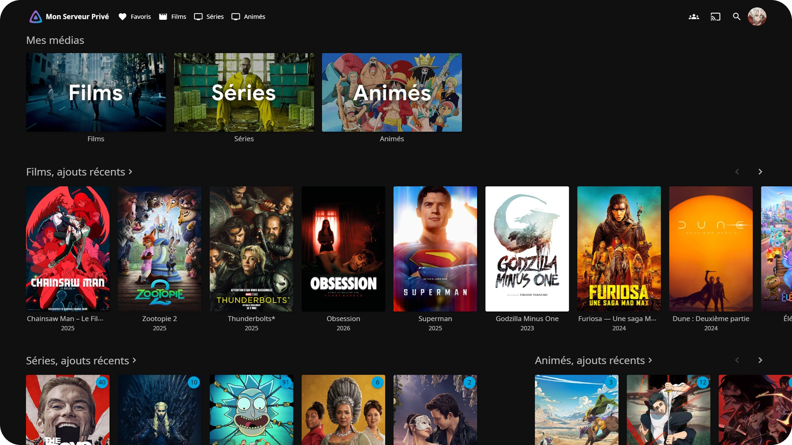

# 🎬 Private Media Server

A private media server that allows you and your friends to stream video content and request new content to be downloaded automatically.

 

	

 

## 📋 Summary

* **[📋 Summary](#-summary)**
* **[✨ Features](#-features)**
	* [Request](#request)
	* [Watch](#watch)
	* [Security](#security)
* **[🛒 Requirements](#-requirements)**
* **[🏗️ Architecture](#%EF%B8%8F-architecture)**
	* [Local computer](#local-computer)
	* [VPS](#vps)
* **[🛠️ Setup](#%EF%B8%8F-setup)**
	* [Part 1: DNS](docs/01_dns.md)
	* [Part 2: VPS base setup](docs/02_vps_base_setup.md)
	* [Part 3: Local computer base setup](docs/03_local_computer_base_setup.md)
	* [Part 4: WireGuard tunnel](docs/04_wireguard_tunnel.md)
	* [Part 5: Caddy and wildcard TLS](docs/05_caddy_and_wildcard_tls.md)
	* [Part 6: Entry point hardening](docs/06_entry_point_hardening.md)
	* [Part 7: Jellyfin](docs/07_jellyfin.md)
	* [Part 8: Gluetun](docs/08_gluetun.md)
	* [Part 9: qBittorrent](docs/09_qbittorrent.md)
	* [Part 10: Prowlarr and Byparr](docs/10_prowlarr_and_byparr.md)
	* [Part 11: Radarr and Sonarr](docs/11_radarr_and_sonarr.md)
	* [Part 12: Bazarr](docs/12_bazarr.md)
	* [Part 13: Seerr](docs/13_seerr.md)
	* [Part 14: Users](docs/14_users.md)
	* [Part 15: Monitoring](docs/15_monitoring.md)
	* [Part 16: Updates](docs/16_updates.md)
	* [Part 17: Maintenance](docs/17_maintenance.md)
* **[🙏 Credits](#-credits)**

 

## ✨ Features

### Request

* Anyone with an account can request new content on a user-friendly interface from the web or a mobile app

* The file with the highest quality and in the requested language will be found and downloaded automatically

* Additional subtitles will be downloaded automatically if missing from the original file

### Watch

* Anyone with an account can use a Netflix-like interface from the web, a mobile app, or a smart TV app to browse and watch the content

* Everything is organized with the correct categories, seasons, titles, images, summaries, logos, actors, etc...

* The content is transcoded on the fly if the device can't play the original file

* Chapters are visible with a button to skip intros and recaps

* What has been watched is remembered, so you can continue where you left off

### Security

* Only you can give access to people you trust by creating accounts for them

* Neither interface is indexed by search engines

* Your local IP address is never exposed to the public, users only see the VPS IP address

* Neither your local IP nor the VPS IP is exposed to the torrent swarm

 

## 🛒 Requirements

### 1.&ensp;A local computer with:

* Multiple TB of storage (where the content will be stored)

* A good fiber connection (≥500 Mb/s upload)

* Enough CPU / GPU to transcode video, for example:
	* **[Intel](https://www.intel.com/)** **[iGPU](https://en.wikipedia.org/wiki/List_of_Intel_graphics_processing_units)** / **[Arc](https://www.intel.com/content/www/us/en/products/details/discrete-gpus/arc.html)** with **[Quick Sync (QSV)](https://en.wikipedia.org/wiki/Intel_Quick_Sync_Video)**
	* **[AMD](https://www.amd.com/)** **[iGPU](https://en.wikipedia.org/wiki/List_of_AMD_processors_with_3D_graphics)** / **[Radeon](https://www.amd.com/en/products/graphics/desktops/radeon.html)** with **[VA-API](https://en.wikipedia.org/wiki/Video_Acceleration_API)** / **[AMF](https://gpuopen.com/advanced-media-framework/)**
	* **[NVIDIA](https://www.nvidia.com/)** with **[NVDEC](https://en.wikipedia.org/wiki/NVDEC)** + **[NVENC](https://en.wikipedia.org/wiki/NVENC)**

* Always on

### 2.&ensp;A VPS with:

* ≥500 Mb/s public bandwidth

* Multiple TB/month or unlimited traffic

### 3.&ensp;A domain name with:

* A DNS provider that exposes an API

### 4.&ensp;A VPN provider with:

* Port forwarding support

 

## 🏗️ Architecture

### Local computer

| Component | Role |
| --- | --- |
| **[Docker](https://www.docker.com/)** / **[Docker Compose](https://docs.docker.com/compose/)** | Container engine: most services below run as isolated containers |
| **[WireGuard](https://www.wireguard.com/)** | Opens the tunnel to the VPS from the inside, so no incoming port ever has to be opened at home |
| **[Jellyfin](https://jellyfin.org/)** | The media server itself: stores the accounts, serves the library, and converts video on the fly when a device can't play the original file |
| **[Seerr](https://seerr.dev/)** | The website where users can browse and request new content to be downloaded |
| **[Prowlarr](https://prowlarr.com/)** | Single place to configure the torrent sources, which it then shares with the other tools |
| **[Radarr](https://radarr.video/)** / **[Sonarr](https://sonarr.tv/)** | Watch for requests, search the indexers, hand the download to **[qBittorrent](https://www.qbittorrent.org/)**, then rename and organize the movies / TV shows |
| **[Bazarr](https://www.bazarr.media/)** | Scans the library once files are in place and downloads matching subtitles from dedicated providers |
| **[Byparr](https://github.com/ThePhaseless/Byparr/)** | Proxy that lets **[Prowlarr](https://prowlarr.com/)** reach indexers hidden behind anti-bot protections |
| **[qBittorrent](https://www.qbittorrent.org/)** | The torrent client that actually downloads the files |
| **[Gluetun](https://github.com/qdm12/gluetun)** | Wraps **[qBittorrent](https://www.qbittorrent.org/)** and **[Prowlarr](https://prowlarr.com/)** in a commercial VPN connection, and cuts their network access entirely if that VPN drops, so your home IP is never exposed to other peers |
| **[CrowdSec](https://www.crowdsec.net/)** | Detects account brute-force attempts and sends them to the VPS bouncer so it can block the IPs |
| **[unattended-upgrades](https://wiki.debian.org/UnattendedUpgrades)** | Applies system, **[Docker](https://www.docker.com/)** and **[CrowdSec](https://www.crowdsec.net/)** updates automatically |
| **[What's Up Docker](https://getwud.app/)** | Checks for new versions of all the containers and notifies you when an update is available |

### VPS

| Component | Role |
| --- | --- |
| **[WireGuard](https://www.wireguard.com/)** | Encrypted tunnel to the home computer, so the VPS can reach it without any router configuration |
| **[Caddy](https://caddyserver.com/)** | Public entry point: terminates HTTPS, renews certificates automatically, and forwards each subdomain to the right service through the tunnel |
| **[CrowdSec](https://www.crowdsec.net/)** (+ Firewall Bouncer) | Standard detection of malicious traffic, plus a firewall that blocks the IPs of attackers automatically |
| **[UFW](https://wiki.ubuntu.com/UncomplicatedFirewall)** | Firewall: keeps every port closed except SSH, HTTP, HTTPS and **[WireGuard](https://www.wireguard.com/)** |
| **[unattended-upgrades](https://wiki.debian.org/UnattendedUpgrades)** | Applies system and **[CrowdSec](https://www.crowdsec.net/)** updates automatically |

 

## 🛠️ Setup

This setup is based on my own experience where I used:

* **[Debian](https://www.debian.org/)** for the local computer:
	* Hostname: `mediabox`
	* Transcoding: **[Intel](https://www.intel.com/)** **[iGPU](https://en.wikipedia.org/wiki/List_of_Intel_graphics_processing_units)** with **[Quick Sync (QSV)](https://en.wikipedia.org/wiki/Intel_Quick_Sync_Video)**
	* RAM: 8 GB
	* An SSD for the setup and a hard drive for media storage

* **[OVH](https://www.ovh.com/)** and **[Debian](https://www.debian.org/)** for the VPS:
	* Hostname: `edge-vps`

* **[OVH](https://www.ovh.com/)** for the domain name (with **[Cloudflare](https://www.cloudflare.com/)** DNS):
	* `tv.<DOMAIN>` for the streaming interface
	* `request.<DOMAIN>` for the request interface

* **[Proton VPN Plus](https://protonvpn.com/pricing)** for the VPN

* **[Discord](https://discord.com/)** for the notifications

If you have a different setup, I highly recommend that you give this repository to an LLM and ask it to adapt the instructions to your needs. If a verification step fails, find a solution before continuing, ignoring it will only make the next steps harder to debug.

### [Part 1: DNS](docs/01_dns.md)

### [Part 2: VPS base setup](docs/02_vps_base_setup.md)

### [Part 3: Local computer base setup](docs/03_local_computer_base_setup.md)

### [Part 4: WireGuard tunnel](docs/04_wireguard_tunnel.md)

### [Part 5: Caddy and wildcard TLS](docs/05_caddy_and_wildcard_tls.md)

### [Part 6: Entry point hardening](docs/06_entry_point_hardening.md)

### [Part 7: Jellyfin](docs/07_jellyfin.md)

### [Part 8: Gluetun](docs/08_gluetun.md)

### [Part 9: qBittorrent](docs/09_qbittorrent.md)

### [Part 10: Prowlarr and Byparr](docs/10_prowlarr_and_byparr.md)

### [Part 11: Radarr and Sonarr](docs/11_radarr_and_sonarr.md)

### [Part 12: Bazarr](docs/12_bazarr.md)

### [Part 13: Seerr](docs/13_seerr.md)

### [Part 14: Users](docs/14_users.md)

### [Part 15: Monitoring](docs/15_monitoring.md)

### [Part 16: Updates](docs/16_updates.md)

### [Part 17: Maintenance](docs/17_maintenance.md)

 

## 🙏 Credits

* **[Jellyfin](https://jellyfin.org/)**: for the media server interface

* **[Seerr](https://seerr.dev/)**: for the request interface

* **[Radarr](https://radarr.video/)**: for the movie management

* **[Sonarr](https://sonarr.tv/)**: for the TV show management

* **[Prowlarr](https://prowlarr.com/)**: for the indexer management

* **[Bazarr](https://www.bazarr.media/)**: for the subtitle management
